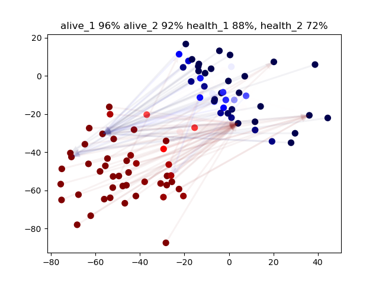

# multi-rl-crowd-sim
Multi-Agent Reinforcement Learning of Crowd Simulation in GPU (PyTorch)  
Also, developing Predator-Prey Behaviours and a Battlefield Simulation!

Check the following videos for behaviour learnt by each simulation type:

**main_random.py** https://www.youtube.com/watch?v=VC5WT70MBQU  
**main_circle.py** https://www.youtube.com/watch?v=B48TkaBFe-c  
**main_hunt.py** https://www.youtube.com/watch?v=Ds9O9wPyF8g  
**main_army.py** https://www.youtube.com/watch?v=IZ1Ht6k2U5E

**gym_hunt.py** Gym environment for Predator-Prey Behaviours (in-progress)

**Ranged army self-play on a battlefield with obstacles is also in-progress!**
  
Note: This is like a Sniper army battle where they can hide behind each other.  
The strength of hitting also reduces as their health decrease by the attacks.
